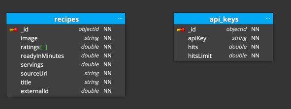

# Spoonacular API: Spring Boot with Spring Security & MongoDB

## Solution overview

### Security

`SecurityConfiguration.java` provides a `SecurityFilterChain` bean to define in the `authorizeHttpRequests` method that every endpoint with the pattern `/swagger-ui/**` should be public and require no authentication,
with the purpose of using the Swagger UI to the test the API.
Authentication is required for all endpoints with pattern `/api/**`.
The session management policy is set to STATELESS and the form login authentication disabled.
For the sake of simplicity CORS and CSRF are disabled too.

`ApiKeyAuthFilter` class sets an authentication filter accepting a predefined API key from the query parameters,
through the usage of a component (`ApiKeyAuthExtractor`) for extracting the authentication from the request parameters.
`extract` looks for an entry in the request parameters identified by `apiKey`, which must contain the value of a expected key in a Document stored in the MongoDB Collection `api_keys`.
If the `apiKey` has a match and the total number of hits has not exceeded its limit (`hitsLimit` field in the Document), the request is authenticated and the `histLimit` field incremented. 

The key extractor component will create an object of the class `ApiKeyAuth` (extends from `AbstractAuthenticationToken`) when a correct API key is found in the query parameters.
The instance is then handed over to the security context by the authentication filter component.
The authentication filter is injected into the security configuration component and employed to manage access to protected endpoints.

`UnauthorizedHandler` is an exception handler provided to the security filter chain that is responsible for sending the status code 401 to the client if any error occurs at the authentication entry point.

### API

 
> Please see documentation on each Class for further explanation on how the API works.

The Spoonacular API includes endpoints for:
- Creating a new recipe
- Retrieving recipes by their IDs
- Searching for recipes
- Updating a recipe's information
- Rating a recipe
- Retrieving a recipe's rating.

## MongoDB

- The default MongoDB URI `spring.data.mongodb.uri` can be updated in the `application.properties` file or set an environment variable: `export MONGODB_URI=mongodb://localhost:27017`.
- Spring Data MongoDB is not used, the MongoDB driver is more flexible and already provides everything needed to code efficiently and optimise queries correctly.
- Implementation of DB interaction with Recipes Repository in `MongoDBRecipeRepository.java`.
- MongoDB typed collection with automatic mapping to POJOs using codecs in `MongoDBConfiguration.java`.
- Manipulation of ObjectId across the REST API, the POJOs and the database itself. See `RecipeDTO.java`.

## Application requirements:

- Java 21
- Spring boot 3.2.2
- MongoDB 7.0
- MongoDB Java driver 4.11.1
- Maven 3.8.7
- OpenAPI 3

## Available commands

- Start the server in a console with `mvn spring-boot:run`.
- Build the project with `mvn clean package`.
- Run the project with the jar and the embedded Tomcat: `java -jar target/spoonacular-api-1.0.0.jar`.

## Swagger & OpenAPI 3

- `springdoc-openapi-starter-webmvc-ui` library dependency is used.
- The Swagger UI can be seen at [http://localhost:8080/swagger-ui/index.html](http://localhost:8080/swagger-ui/index.html).
